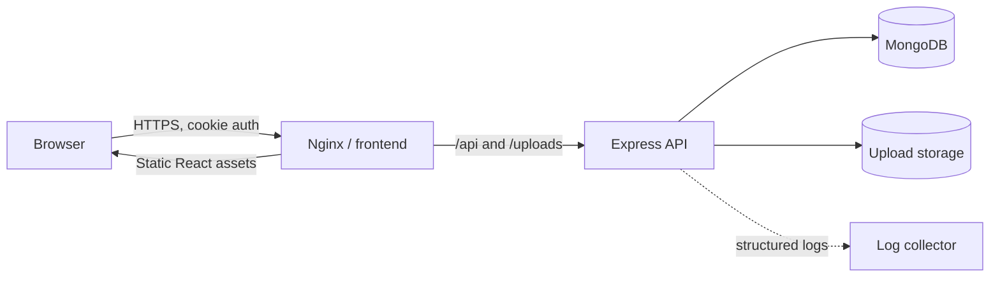
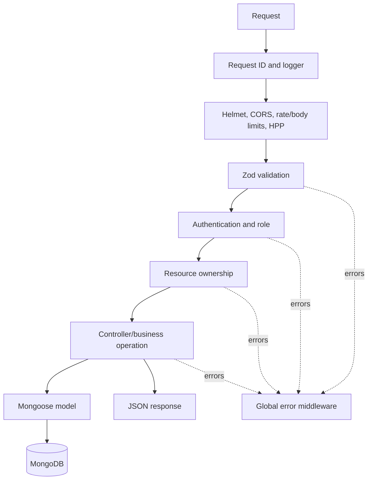
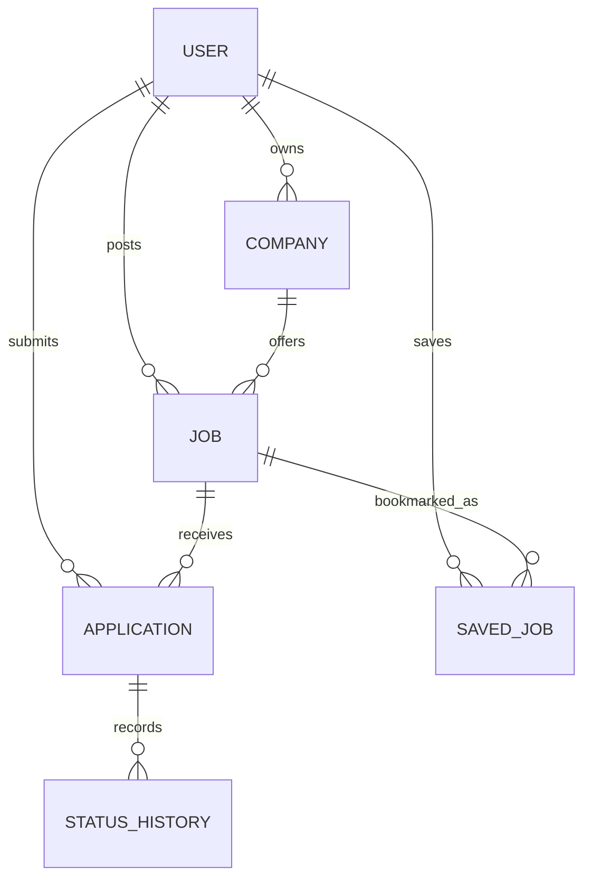
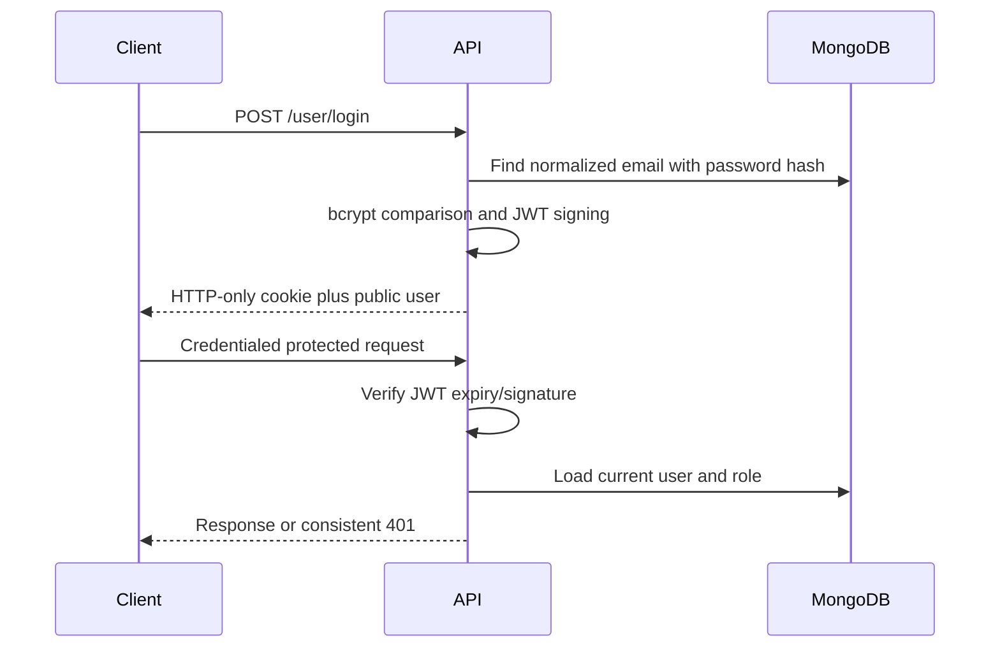
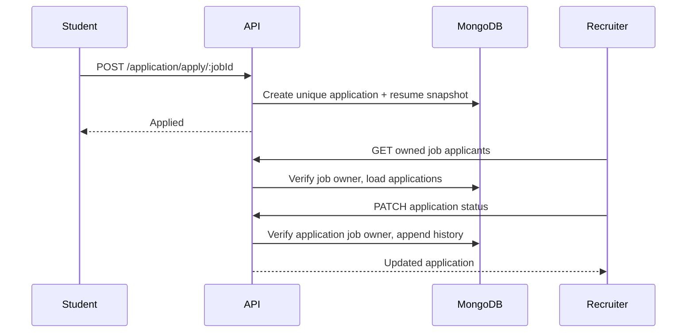

# JobNet Architecture

## System overview



The repository keeps the existing React, Express, and MongoDB stack. The production frontend is compiled once and served by Nginx. Nginx proxies same-origin API and upload requests to the backend, avoiding browser-side hard-coded service origins.

## Frontend architecture

```text
src/
  components/       route screens and reusable UI
  hooks/            server synchronization hooks
  lib/api.js        one credentialed Axios client and error normalization
  redux/            client/session/view state
  utils/            display/search taxonomy helpers
```

Redux stores the signed-in public user, job results and pagination, recruiter data, applications, and saved-job state. MongoDB remains authoritative for saved jobs and applications. `redux-persist` improves refresh UX but does not establish authentication or authorization; `/user/me` and protected API responses remain authoritative.

Job discovery sends structured filters to the API. The API performs filtering, relevance ordering, and bounded pagination. The browser only renders the returned page.

## Backend architecture



- `app.js` constructs an importable Express application.
- `index.js` connects dependencies, starts HTTP, and handles process signals.
- `config/env.js` validates configuration once at startup and supports documented compatibility aliases.
- Middleware handles cross-cutting security, request validation, authentication, roles, ownership, uploads, logging, and errors.
- Controllers coordinate domain operations and throw `AppError` values.
- Models own data shape and query-supporting indexes.

## Database relationships



Important constraints:

- User email is normalized and unique.
- `(Application.job, Application.applicant)` is unique.
- `(SavedJob.user, SavedJob.job)` is unique.
- Recruiter listings are indexed by owner and creation time.
- Active job listings are indexed by status and creation time.

## Authentication flow



Cookies are HTTP-only, secure in production, explicitly scoped, and configurable for SameSite deployment needs. JWT failures always produce a response. Password hashes are excluded by default.

## Authorization flow

Authentication establishes the current database user. `requireRole` then enforces student/recruiter capabilities. Ownership middleware loads the requested company, job, or application and compares its owner to the authenticated recruiter before the controller runs.

This prevents recruiters from editing another recruiter's company/job, reading another job's applicants, or changing another recruiter's application statuses. Candidate operations are student-only.

## Job search flow

1. The user changes structured filters; keyword input is debounced.
2. The frontend sends bounded query parameters.
3. Zod coerces numeric values and rejects unsupported sorts or excessive limits.
4. The controller escapes user regex input and builds MongoDB filters.
5. Keyword queries receive understandable title/category relevance weights.
6. MongoDB returns one populated page plus a separate count.
7. The frontend renders results and pagination controls.

Location aliases are normalized at write and query time for Bengaluru/Bangalore, Gurugram/Gurgaon, and Delhi NCR/Delhi.

## Application flow



The unique database index handles concurrent duplicate applications. Status changes record who changed the status, when, and an optional note.

## File upload flow

Profile images, company logos, and resumes use separate Multer policies and staging directories. Size, extension, declared MIME, and detected file signature must agree before controller use. `STORAGE_PROVIDER=local` exposes files under `/uploads` for development. `STORAGE_PROVIDER=cloudinary` sends files to separate `JobNet/profile-images`, `JobNet/company-logos`, and `JobNet/resumes` folders, removes the local staging file, and leaves route contracts unchanged.

## Deployment architecture

- Development: `docker-compose.yml` runs Vite, Node watch mode, and MongoDB with service health ordering.
- Production-like: `docker-compose.prod.yml` builds immutable production images, runs the backend with `node`, serves the frontend with Nginx, and uses named data volumes.
- CI: installs from lockfiles, checks backend syntax, runs backend tests, lints/builds the frontend, and builds both images.
- Secrets are injected through an untracked production environment file or the deployment platform's secret manager.

In a hosted production environment, TLS should terminate at the platform load balancer/reverse proxy, logs should be shipped from stdout, MongoDB should use managed authentication/backups, and uploads should move to Cloudinary or durable object storage.
