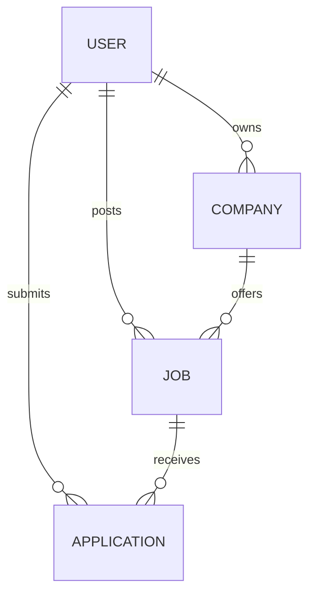

# JobNet Project Audit

Audit date: 2026-10-08

## Executive summary

JobNet is a compact MERN application with a React/Vite client and an Express/Mongoose API. Its principal candidate and recruiter flows already exist: registration and login, profile and resume updates, company creation, job posting and discovery, applications, and applicant status updates. The repository also contains recent work on richer job filters, relevance helpers, responsive navigation, loading states, and a client-persisted saved-jobs list.

The project is a useful functional prototype, but it is not production-ready. The highest-risk issues are missing backend role and ownership authorization, inconsistent error paths (including requests that can hang after JWT errors), weak upload controls, hard-coded origins and asset URLs, absent request validation, and missing database constraints. Production deployment, tests, observability, and complete API documentation are also absent.

This audit treats the current uncommitted local-upload and saved-job work as user-owned work to preserve. Subsequent changes should migrate those features instead of discarding them.

## Current architecture

```text
Browser (React 18 + Vite + Redux Toolkit + redux-persist)
  -> Axios calls with cookie credentials
Express 4 API (route -> auth middleware -> controller)
  -> Mongoose 8 models
MongoDB

Uploads currently use local disk under backend/uploads.
Cloudinary utilities are present but are not used consistently.
```

The repository has no root package workspace. The frontend and backend are independently installed applications, joined for development by Docker Compose.

## Frontend architecture

- `frontend/src/App.jsx` defines public candidate routes and recruiter routes wrapped in `ProtectedRoute`.
- Redux stores authentication, jobs, filters, applications, companies, and locally saved job IDs. The entire root reducer is persisted to browser storage.
- Hooks fetch jobs, recruiter jobs, companies, and applications directly with Axios.
- API roots are duplicated as four hard-coded `http://localhost:8000` constants.
- Search filters are represented in Redux and sent to the backend. A second client-side search/ranking implementation remains in `searchUtils.js`, creating two potential sources of truth.
- UI components provide job cards/details, application tables, profile editing, company management, and recruiter applicant management.

### Frontend findings

- Route protection only checks persisted Redux state, can briefly render protected content, and cannot provide security.
- Axios configuration and error extraction are repeated. Several handlers dereference `error.response.data.message` unsafely.
- Persisting the entire auth/user state can leave stale authorization state after server-side cookie expiry.
- Saved jobs are only persisted in Redux/local storage, so they are not portable across devices and may disappear from the table when a filtered job response does not contain them.
- The profile page still renders a hard-coded Shutterstock avatar and uses a constant indicating that a resume exists.
- Profile form field names are incorrect for fullname and phone (`name` and `number` instead of `fullname` and `phoneNumber`), so those changes are not submitted as intended.
- Applying uses a state-changing `GET` endpoint and logout also uses `GET`.
- Hooks do not cancel stale requests. Search requests are not debounced.
- Several effects omit stable dependencies, and API errors often only reach the console.
- Empty table states render a `span` directly inside a table body, which is invalid table markup.
- Recruiter applicant status is limited to Accepted/Rejected in the UI and is not refreshed after mutation.
- Accessibility is inconsistent: radio inputs have mismatched labels/IDs, icon buttons lack labels, and some clickable non-button elements are keyboard-inaccessible.
- There is no frontend test setup, route-level error boundary, 404 page, or production Nginx/static-server configuration.

## Backend architecture

- `backend/index.js` configures Express and mounts four route modules under `/api/v1`.
- Controllers contain HTTP parsing, validation, business logic, persistence, and response formatting.
- `isAuthenticated` verifies a cookie JWT and adds `req.id`.
- Mongoose models cover User, Company, Job, and Application.
- Multer currently writes uploads to a local directory; Cloudinary and Data URI utilities also remain.

### Backend findings

- Controllers repeat `try/catch` blocks and console logging, with inconsistent or missing responses.
- There is no centralized error type, async wrapper, request ID, structured logger, or global error handler.
- Request data is manually checked, coercion is inconsistent, and malformed MongoDB IDs can reach Mongoose.
- CORS and uploaded-file URLs are hard-coded to localhost.
- The HTTP server begins listening before database connection success is known.
- No body-size controls, security headers, rate limiting, parameter-pollution protection, or controlled trust-proxy setting exist.
- API success and error shapes are inconsistent (`succees` is misspelled in one response).
- No health/readiness endpoints or graceful shutdown exist.

## Database architecture



### Data integrity findings

- User email is unique but is not normalized before lookup/storage. Password hashes are selected by default.
- Phone number is stored as a number, losing formatting and potentially leading zeroes.
- Company name is globally unique, while ownership is not part of the uniqueness or lookup rules.
- Jobs have no lifecycle status or slug. `created_by` is the posting user but naming differs from the requested `postedBy` convention.
- Application has only `pending`, `accepted`, and `rejected`; there is no database-level unique `(job, applicant)` index, history, notes, or resume snapshot.
- No SavedJob model exists.
- Current indexes do not match the major ownership, listing, and application queries. The single broad text index alone does not support pagination or compound filters.

## Authentication flow

1. Registration accepts multipart input, hashes the password, and optionally stores a local profile-photo URL.
2. Login checks email, password, and a client-supplied role, signs a one-day JWT, and sets a cookie.
3. Authenticated routes verify the token from the cookie and copy its user ID to `req.id`.
4. Logout overwrites the cookie and the frontend clears Redux auth state.

### Authentication vulnerabilities

- Cookie option `httpsOnly` is a typo; therefore the token cookie is not configured as `httpOnly`.
- Cookie `secure`, domain/path, max age, and environment-specific SameSite behavior are not centrally configured.
- JWT verification errors are logged but do not send a response, leaving requests hanging.
- Missing/weak JWT secrets are not rejected at startup.
- Authentication does not load a current user, so deleted/disabled users and current roles are not checked.
- Login role is trusted as an extra credential and produces confusing account-enumeration behavior.
- No auth-specific rate limiting or brute-force mitigation exists.
- GET logout has CSRF-like side effects and is cache-unfriendly.

## Authorization flow

All protected API routes use the same authentication middleware. There is no backend role middleware and no reusable ownership policy.

### Critical authorization vulnerabilities

- A student can post jobs, create companies, view applicants, and update application statuses by calling APIs directly.
- A recruiter can fetch or edit another recruiter's company by ID.
- A recruiter can view applicants for another recruiter's job.
- A recruiter can update another recruiter's application status.
- Job details expose populated applications to any authenticated user.
- Application submission is not restricted to students.

These are direct-object-reference (IDOR) vulnerabilities and are the highest-priority production blockers.

## Job search flow

The client builds query parameters from Redux filters. The backend constructs MongoDB regex/range filters, populates company details, and sorts results. The client retains additional filtering and relevance utilities.

### Search and performance findings

- There is no server-side pagination or maximum result limit, so one request can load the full collection.
- User input is interpolated into regular expressions without escaping, enabling expensive or malformed regex behavior.
- Relevance ranking described by the README is mainly client-side and is not authoritative at database scale.
- Salary overlap semantics and the current query conditions need normalization and tests.
- `skills` is not wired through the backend query.
- Location normalization only handles exact alias values and is duplicated across client/server.
- Public job discovery currently requires authentication.
- Responses do not expose pagination metadata.

## Application flow

Candidates call `GET /application/apply/:id`; the controller performs a duplicate lookup, creates an application, and pushes its ID into the job document. Recruiters fetch a populated job and mutate application status.

### Application findings

- GET performs a mutation.
- Duplicate prevention is race-prone without a unique database index.
- Creating an application and updating the job's application array are not atomic.
- Status values are converted to lowercase and constrained to only three lifecycle states.
- Recruiter ownership is not verified.
- No status history or `lastUpdatedBy` exists.
- Job-level application arrays duplicate a relationship already represented by Application documents and can grow without bound.

## File upload flow

Registration and profile update accept a single field named `file`. Current uncommitted code writes files to local disk and exposes `/uploads` publicly. Company update still assumes a file and sends it to Cloudinary.

### Upload vulnerabilities and debt

- No MIME signature or allowed-MIME validation is performed.
- No upload size limits exist.
- Client-provided extensions are retained.
- Profile images and resumes share one upload handler and directory.
- Files can remain orphaned after replacement or failed database writes.
- Public local upload URLs are hard-coded to localhost.
- Company update can throw when no file is provided.
- Cloudinary resource type/folder rules and deletion behavior are not configured.
- Resume access is public rather than authorization-aware.

## Existing bugs

- JWT verification failures can hang indefinitely.
- `httpsOnly` does not protect the auth cookie.
- Profile fullname/phone inputs submit the wrong field names.
- Profile always shows a third-party placeholder image.
- Profile resume rendering assumes presence.
- Company update crashes when `req.file` is absent.
- Applicant response uses `succees` instead of `success`.
- Job application status casing conflicts between controller/UI/model conventions.
- Backend defaults to port 3000 while Docker and frontend expect 8000 unless environment configuration compensates.
- The Docker backend starts with Nodemon and the frontend starts Vite's development server.
- README claims several production patterns and ranking behavior that are partial or absent.

## Security vulnerabilities

Priority order:

1. Missing role and ownership checks (authorization bypass/IDOR).
2. Insecure auth cookie and incomplete JWT failure handling.
3. Unrestricted uploads and public resume exposure.
4. Unbounded/regex-driven search queries.
5. Missing validation and sanitization at trust boundaries.
6. Hard-coded CORS/origin behavior and absent security headers/rate limits.
7. Sensitive fields selected/populated by default.
8. No explicit CSRF strategy for cookie-authenticated state changes.

## Missing validation

- Auth: normalized email, password policy, phone shape, role enum, name length.
- Company: name, URL, description/location lengths, file type.
- Job: required text lengths, numeric ranges, enum values, ObjectIds, salary consistency, deadline.
- Application: ObjectIds, allowed transitions, cover-letter/note lengths.
- Query strings: page/limit bounds, sort allowlist, numeric coercion, regex escaping.
- Uploads: MIME, magic bytes, size, per-purpose file types.

## Recommended indexes

Indexes should support observed queries rather than every possible filter:

- User: unique normalized email.
- Company: `{ userId: 1, createdAt: -1 }`; retain or reconsider global name uniqueness according to product rules.
- Job: `{ status: 1, createdAt: -1 }`, `{ created_by: 1, createdAt: -1 }`, `{ company: 1, createdAt: -1 }`; retain a weighted text index for keyword search.
- Application: unique `{ job: 1, applicant: 1 }`, `{ applicant: 1, createdAt: -1 }`, `{ job: 1, status: 1, createdAt: -1 }`.
- SavedJob: unique `{ user: 1, job: 1 }`, plus `{ user: 1, createdAt: -1 }`.

Location/category compound indexes should be added only after production query measurements show that they are selective enough to justify write/storage cost.

## Missing tests

- No backend test runner or API tests.
- No frontend component/integration test runner.
- No E2E test setup.
- No authorization regression suite, which is especially important given the ownership risks.
- No upload validation, pagination, search, model-index, or graceful-shutdown tests.

## Missing deployment infrastructure

- No production Dockerfiles, non-root runtime, multi-stage frontend build, or static web server.
- `mongo:latest` is unpinned and services have no health checks.
- No production-like Compose configuration.
- No CI workflow.
- No environment examples or startup validation.
- No reverse-proxy/TLS assumptions documented.
- No migration/index deployment procedure, backup policy, or monitoring integration.

## Technical debt

- Controllers combine too many responsibilities.
- Naming is inconsistent (`created_by`, `userId`, `experienceLevel`, and lowercase statuses).
- `mutler.js` is misspelled and mixes storage policy with route middleware.
- Job search taxonomy and location aliases are duplicated.
- Some relational data is duplicated in arrays and separate collections.
- Console logging and hard-coded UI copy are widespread.
- There are only two commits and no automated quality gate.

## Recommended implementation order

1. Add configuration validation, request IDs/logging, centralized errors, schema validation, security middleware, health/readiness, and graceful shutdown.
2. Enforce authentication, roles, and resource ownership on every backend route; harden cookies and JWT handling.
3. Add data constraints/indexes, application lifecycle/history, and persistent saved jobs.
4. Make backend search authoritative with escaped queries, relevance behavior, bounded pagination, and tests.
5. Centralize the frontend API client, synchronize server auth/saved jobs, and repair profile/application UX.
6. Add backend and frontend test suites, then E2E tests for candidate and recruiter journeys.
7. Add production Docker/Compose and CI, followed by API/architecture documentation and observability guidance.
8. Build dashboards, recommendation scoring, and final UX/SEO polish after the security and data foundations are stable.

## Audit conclusion

The existing feature set is worth preserving, and the project can be upgraded incrementally without changing its stack. Security boundaries and data constraints must be corrected before expanding dashboards or AI matching. The immediate implementation should preserve existing endpoint paths where practical, introduce compatible aliases when HTTP methods must change, and retire legacy behavior only after the frontend and tests have migrated.
